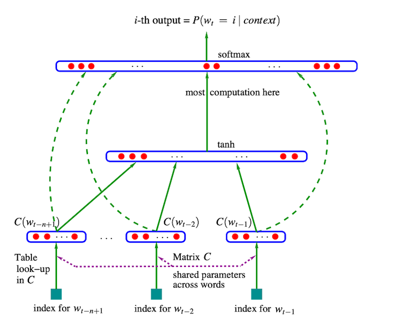
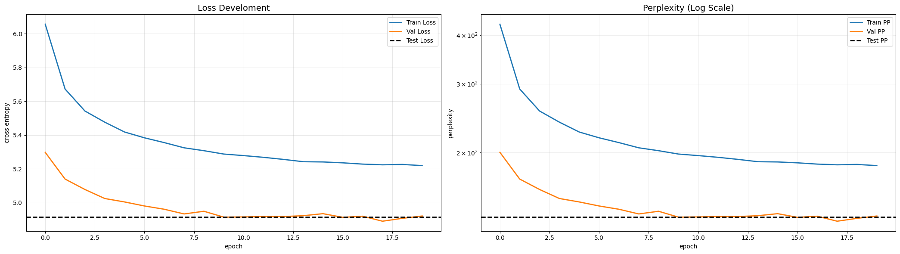
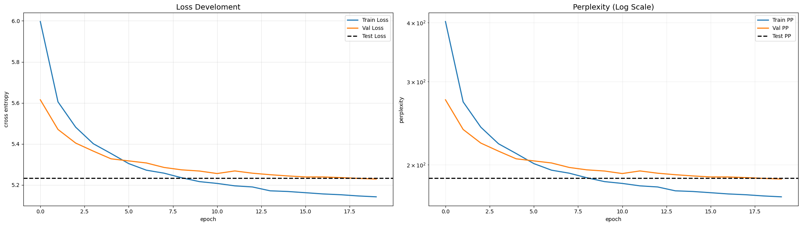
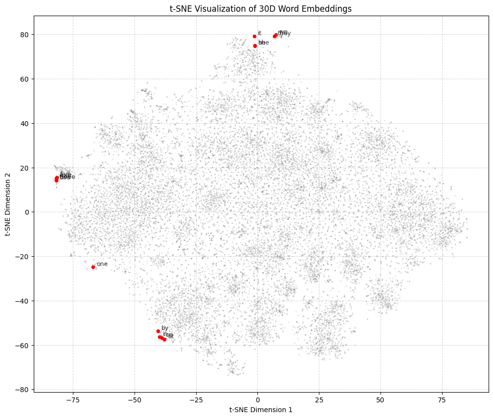

# MLP for language generation based on Bengio et al. (2003)

I implemented a simple MLP for text generation, taking an input of length n and using a 30-dimensional embedding matrix. The MLP is based on the architecture proposed by Bengio et al. (2003) in the paper "A Neural Probabilistic Language Model". Like the paper did, I implemented a interpolated trigram model which the state of the art architecture for language prediction in the early 2000s, serving as a baseline in the experiments. As in the paper, the MLP achieved a 10-20% improvement in test set perplexity.

### But why is a MLP better then N-gram models?

N-gram models rely on a fixed context size and treat each word as completely distinct, which prevents them from capturing long-range dependencies and word similarity. As a result, they struggle to generalize to unseen word combinations and suffer from the curse of dimensionality. The proposed MLP-based language model by Bengio et al. (2003) overcomes these issues by learning continuous word embeddings, allowing semantically similar words (e.g. cat and dog) to share information, and by increasing the effective context size through hidden layers. This enables better generalization and more efficient probability estimation, leading to significantly lower perplexity compared to n-gram baselines. 




## Motivation

Having implemented a transformer in a recent deep learning class, I wanted to gain a deeper practical understanding of the development that led to transformers in text generation. To do this, I started by exploring n-gram models and their transition to multilayer perceptrons, with the Bengio et al. (2013) paper serving as a key reference. After completing this project, I plan to focus on recurrent neural networks, again implementing a paper from scratch. Finally, I will revisit and extend my university transformer project, completing a hands-on journey to understanding transformers and the evolution of the underlying problem in depth.


## Findings

### Final comparison between MLP and Baseline (Trigram model)

| Setting         | Model    | Perplexity | Difference (%) |
|-----------------|---------|------------|----------------|
| Non-randomized  | Baseline | 168.7844   | -              |
|                 | MLP      | 136.2351   | 19.28%         |
| Randomized      | Baseline | 210.8290   | -              |
|                 | MLP      | 187.3766   | 11.12%         |

Thus, despite differences in absolute perplexity values, I was able to reproduce the clear superiority of the MLP approach over the n-gram baseline. Some aspects of the data preprocessing in Bengio et al. remain unclear, as the paper does not specify whether or how the dataset was shuffled. During my experiments, I observed substantially lower validation and test perplexity compared to training perplexity, indicating a bias in the data caused by non-randomized splits. When randomization was applied, overall perplexity values increased, but the results became more statistically stable and better aligned with realistic generalization behavior.





### t-SNE visualized word embeddings

Despite the relatively small size of the Brown Corpus, the t-SNE visualization confirms that the MLP has successfully learned distributed representations with clear semantic structure. Notice the distinct, tight clusters for:
*  Functional Pronouns: (he, she, it, they, we)
*  Numerical Entities: (two, three, five)
*  Spatial Prepositions: (in, on, at, by)

This proves that the model didn't just 'memorize' word sequences, but mapped words with similar grammatical and semantic roles to similar locations in the 30-dimensional embedding space.




## Project structure

```
bengio-2003-mlp/
├── README.md
├── requirements.txt
├── data/
│   └── processed/
│       └── brown/                 
├── notebooks/
│   └── bengio2003_experiments.ipynb             
├── scripts/
│   └── main.py                    
├── src/
│   ├── model.py                   
│   ├── evaluate.py                
│   ├── data_utils.py              
│   ├── baseline.py                
│   └── config.py                  
└── results/ 
```

## How to run

Install dependencies:

`pip install -r requirements.txt`

Run default experiment:

`python -m scripts.main --device cpu`

Tune hyperparameters by using the specific flag:

| Flag              | Type    | Default | Description |
|------------------|---------|---------|-------------|
| `--device`        | str     | auto    | Device to use (`cpu`, `cuda`); automatically detected if not specified |
| `--model`         | str     | mlp     | Model type (`mlp` or `baseline`) |
| `--emb_dim`       | int     | 30      | Dimension of word embeddings |
| `--hidden_dim`    | int     | 100     | Size of the hidden layer in the MLP |
| `--epsilon_t`     | float   | 0.1     | Initial learning rate |
| `--epochs`        | int     | 20      | Number of training epochs |
| `--batch_size`    | int     | 32      | Mini-batch size |
| `--weight_decay`  | float   | 1e-4    | L2 regularization / weight decay |
| `--lr_decay`      | float   | 1e-8    | Learning rate decay per step |
| `--shuffle`       | bool    | True    | Shuffle sentences before split (`--no-shuffle` disables) |
| `--context_size`  | int     | 5       | Input context size |

## References

Bengio, Y., Ducharme, R., Vincent, P., & Jauvin, C. (2003). A neural probabilistic language model. Journal of machine learning research, 3(Feb), 1137-1155.